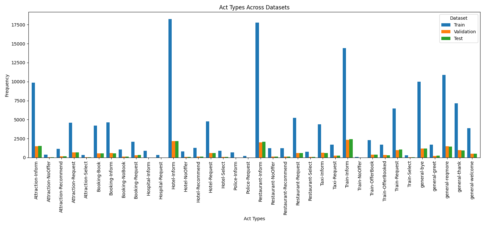
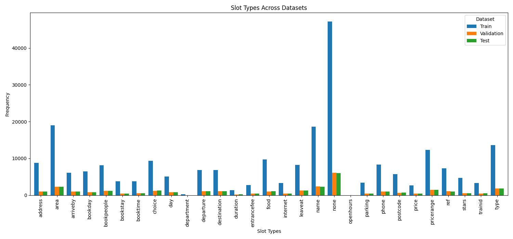
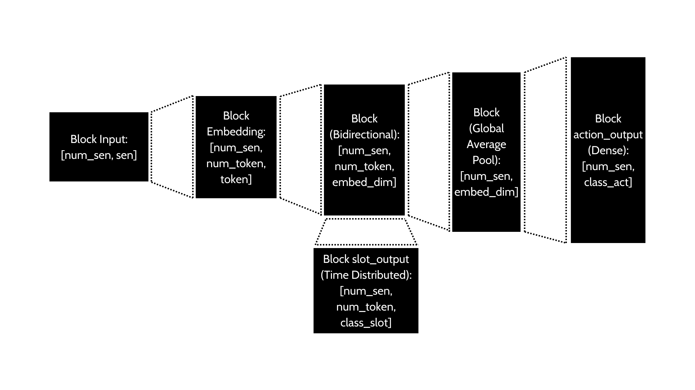

---

# Abstract


# Introduction

Theo dõi trạng thái hội thoại (Dialogue State Tracking - DST) là một thành phần **then chốt** trong các hệ thống hội thoại hướng tác vụ (Task-Oriented Dialogue Systems).

Mục tiêu của DST là theo dõi và cập nhật trạng thái hội thoại theo thời gian thực, dựa trên các lượt tương tác giữa người dùng và hệ thống.
Từ đó hỗ trợ cho việc đưa ra quyết định và tạo phản hồi phù hợp từ hệ thống.

Trạng thái này bao gồm những thông tin quan trọng như:

- **Ý định của người dùng (User Intent):** Mong muốn hoặc mục đích của người dùng (ví dụ: đặt vé máy bay, tìm nhà hàng, hỏi thời tiết).
- **Tham số liên quan (Slots/Entities):** Các chi tiết cụ thể liên quan đến ý định, như điểm đi, điểm đến, thời gian, hoặc các yêu cầu đặc thù khác.

**Ví dụ Minh Họa**

Người dùng: "Tôi muốn đặt vé máy bay từ Hà Nội đi Sài Gòn vào ngày mai."

Trong trường hợp này, DST cần xác định:

- **Ý định:** Đặt vé máy bay.

- **Tham số liên quan:**

  - Điểm đi: Hà Nội.

  - Điểm đến: Sài Gòn.

  - Ngày đi: Ngày mai.

# Related Work

## Các Hướng Nghiên Cứu Chính

### **Mô Hình Dựa Trên Bản Thể (Ontology-Based Models)**

- **Bản thể tĩnh (Static Ontology):** Giới hạn trong một tập hợp trạng thái cố định (ví dụ: FJST, TSCP).
- **Bản thể động (Dynamic Ontology):** Linh hoạt trong việc dự đoán các trạng thái mới (ví dụ: TRADE, TripPy, SOM-DST).

**1. Phương Pháp Dựa Trên Ontology (Ontology-Based Methods):**

- **Ý tưởng:** Các phương pháp này sử dụng một ontology chứa tập giá trị slot được xác định trước, từ đó dự đoán giá trị slot dựa trên danh sách các giá trị khả dĩ.
- **Ưu điểm:** Phù hợp với các hệ thống có miền xác định rõ ràng, đơn giản và dễ triển khai.
- **Nhược điểm:** Hạn chế trong việc mở rộng sang miền mới và xử lý các giá trị chưa biết.
- **Nghiên cứu cụ thể:**
  * \cite{feng2020sequence} **"Method_A Sequence-to-Sequence Approach to Dialogue State Tracking.pdf"**: Bài báo này đề xuất phương pháp Seq2Seq-DU, sử dụng BERT để mã hóa các câu nói và lược đồ, sau đó dùng bộ giải mã để tạo con trỏ đại diện cho trạng thái hiện tại của hội thoại. Bài báo cũng so sánh Seq2Seq-DU với các phương pháp DST hiện có trên nhiều tập dữ liệu khác nhau, bao gồm cả các phương pháp dựa trên bản thể.
  * \cite{lim2023adaptive} **"Method_Adaptive Multi-Domain Dialogue State Tracking on Spoken Conversations.pdf"**: Bài báo này đề cập đến các phương pháp dựa trên bản thể tĩnh (Static Ontology-based) như một trong những hướng tiếp cận chính cho DST truyền thống.
  * zhu2022continual **"Method_Continual Prompt Tuning for Dialog State Tracking.pdf"**: Bài báo này phân loại các phương pháp DST, bao gồm cả phương pháp dựa trên bản thể tĩnh, dựa trên việc sử dụng tập hợp ứng viên giá trị slot.
  * xu2023dialogue **"Method_Dialogue State Distillation Network with Inter-slot Contrastive Learning for Dialogue State Tracking.pdf"**: Bài báo này chia các phương pháp DST thành hai loại: dựa trên bản thể và không dựa trên bản thể.
  * ouyang2020dialogue **"Method_Dialogue State Tracking with Explicit Slot Connection Modeling.pdf"**: Bài báo này thảo luận về các phương pháp dựa trên bản thể tĩnh, sử dụng phân loại đa lớp trên tập hợp ứng viên giá trị slot được xác định trước.
  * jeon2021domain **"Method_Domain State Tracking for a Simplified Dialogue System.pdf"**: Bài báo này đề cập đến việc sử dụng các mô hình ngôn ngữ được đào tạo trước như BERT trong các hệ thống hội thoại hướng đến mục tiêu, một số phương pháp trong số đó có thể sử dụng phương pháp dựa trên bản thể.
  * zhao2021effective **"Method_Effective Sequence-to-Sequence Dialogue State Tracking.pdf"**: Bài báo này so sánh phương pháp được đề xuất với nhiều phương pháp cơ sở mạnh, bao gồm cả các phương pháp dựa trên bản thể tĩnh.
  * zhu2020efficient **"Method_Efficient Context and Schema Fusion Networks for Multi-Domain Dialogue State Tracking.pdf"**:  Bài báo này thảo luận về các phương pháp DST dựa trên bản thể tĩnh và so sánh chúng với các phương pháp dựa trên từ vựng mở.
  * le2020end **"Method_End-to-End Multi-Domain Task-Oriented Dialogue Systems with Multi-level Neural Belief Tracker .pdf"**:  Bài báo này phân loại các mô hình DST thành hai loại chính: dựa trên từ vựng cố định và dựa trên từ vựng mở. Mô hình được đề xuất trong bài báo này thuộc loại dựa trên từ vựng mở, nhưng bài báo cũng thảo luận về các mô hình dựa trên từ vựng cố định (tương đương với phương pháp dựa trên bản thể).
  * gao2020machine **"Method_From Machine Reading Comprehension to Dialogue State Tracking_ Bridging the Gap.pdf"**: Bài báo này đề cập đến các phương pháp DST truyền thống dựa trên bản thể tĩnh và thảo luận về những hạn chế của chúng. Bài báo cũng so sánh phương pháp được đề xuất với các phương pháp dựa trên bản thể tĩnh khác.
  * wang2022luna **"Method_LUNA_ Learning Slot-Turn Alignment for Dialogue State Tracking.pdf"**: Bài báo này phân loại các phương pháp DST thành hai loại: phân loại và tạo. Các phương pháp phân loại thường dựa trên bản thể tĩnh.
  * lin2021leveraging **"Method_Leveraging Slot Descriptions for Zero-Shot Cross-Domain Dialogue State Tracking.pdf"**: Bài báo này đề cập đến các phương pháp DST dựa trên bản thể tĩnh và thảo luận về việc sử dụng mô tả slot để cải thiện hiệu suất của chúng. Bài báo cũng so sánh phương pháp được đề xuất với các phương pháp dựa trên bản thể tĩnh khác.
  * huang2020meta **"Method_Meta-Reinforced Multi-Domain State Generator for Dialogue Systems.pdf"**: Bài báo này thảo luận về các phương pháp DST dựa trên bản thể tĩnh và so sánh chúng với các phương pháp dựa trên từ vựng mở.
  * zeng2020multi **"Method_Multi-Domain Dialogue State Tracking based on State Graph.pdf"**: Bài báo này mô tả các phương pháp DST dựa trên bản thể tĩnh và so sánh hiệu suất của mô hình được đề xuất với các phương pháp dựa trên bản thể tĩnh khác.
  * yang2023multi **"Method_Multi-Domain Dialogue State Tracking with Disentangled Domain-Slot Attention.pdf"**: Bài báo này thảo luận về các mô hình DST dựa trên bản thể và so sánh hiệu suất của mô hình được đề xuất với các phương pháp dựa trên bản thể khác.
  * jia2024multi **"Method_Multi-domain gate and interactive dual attention for multi-domain dialogue state tracking.pdf"**: Bài báo này đề cập đến các mô hình dựa trên bản thể tĩnh và thảo luận về các ưu điểm và nhược điểm của chúng.
  * le2020non **"Method_Non-Autoregressive Dialog State Tracking.pdf"**:  Bài báo này phân loại các mô hình DST thành hai loại: dựa trên từ vựng cố định và dựa trên từ vựng mở. Các mô hình dựa trên từ vựng cố định tương đương với phương pháp dựa trên bản thể.
  * hu2020sas **"Method_SAS_ Dialogue State Tracking via Slot Attention and Slot Information Sharing.pdf"**: Bài báo này tập trung vào việc chia sẻ thông tin slot trong DST dựa trên bản thể.
  * heck2020trippy **"Method_TripPy_ A Triple Copy Strategy for Value Independent Neural Dialog State Tracking.pdf"**: Bài báo này thảo luận về các phương pháp DST truyền thống dựa trên bản thể tĩnh và so sánh chúng với các phương pháp dựa trên từ vựng mở.


**2. Phương Pháp Không Cần Ontology (Ontology-Free Methods):**

- **Ý tưởng:** Trích xuất giá trị slot trực tiếp từ ngữ cảnh hội thoại, không cần tập giá trị xác định trước.
- **Ưu điểm:** Linh hoạt, xử lý được các giá trị chưa biết, phù hợp với các hệ thống mở miền.
- **Nhược điểm:** Khó kiểm soát chất lượng trích xuất giá trị slot.
- **Nghiên cứu cụ thể:**
  * feng2020sequence **"Method_A Sequence-to-Sequence Approach to Dialogue State Tracking.pdf"**: Bài báo này giới thiệu ba phương pháp không cần ontology: COMER, CREDIT, và SimpleTOD. Cả ba phương pháp đều coi DST như một bài toán tạo chuỗi và sử dụng các kiến trúc encoder-decoder để dự đoán chuỗi trạng thái dựa trên câu nói của người dùng.
      * COMER sử dụng mô hình encoder-decoder phân cấp dựa trên BERT.
      * CREDIT cũng sử dụng mô hình encoder-decoder phân cấp nhưng không sử dụng BERT.
      * SimpleTOD sử dụng mô hình chuỗi-chuỗi thống nhất dựa trên GPT-2.
  * zhu2022continual **"Method_Continual Prompt Tuning for Dialog State Tracking.pdf"**: Bài báo này đề cập đến các phương pháp không cần ontology như một cách để giảm sự phụ thuộc vào ontology và cải thiện khả năng khái quát hóa cho các giá trị chưa nhìn thấy. Một số phương pháp trong số này trích xuất giá trị từ ngữ cảnh hội thoại, trong khi một số khác tạo giá trị trực tiếp để xử lý các trường hợp giá trị bị thiếu trong ngữ cảnh.
  * xu2023dialogue **"Method_Dialogue State Distillation Network with Inter-slot Contrastive Learning for Dialogue State Tracking.pdf"**: Bài báo này cũng chia các phương pháp DST thành hai loại: dựa trên bản thể và không dựa trên bản thể. Các phương pháp không dựa trên bản thể tạo ra các giá trị của slot từ ngữ cảnh hội thoại hoặc từ vựng.
  * ouyang2020dialogue **"Method_Dialogue State Tracking with Explicit Slot Connection Modeling.pdf"**: Bài báo này thảo luận về các phương pháp không cần ontology, còn được gọi là các phương pháp từ vựng mở (open vocabulary), cho phép tạo giá trị slot chỉ với các slot mục tiêu.
  * zhao2021effective **"Method_Effective Sequence-to-Sequence Dialogue State Tracking.pdf"**: Bài báo này so sánh phương pháp được đề xuất với nhiều phương pháp cơ sở khác nhau, bao gồm cả các phương pháp không cần ontology.
  * zhu2020efficient **"Method_Efficient Context and Schema Fusion Networks for Multi-Domain Dialogue State Tracking.pdf"**: Bài báo này thảo luận về các phương pháp DST không cần ontology, sử dụng kiến trúc encoder-decoder hoặc mạng con trỏ để tạo hoặc trích xuất giá trị trực tiếp cho mỗi slot từ ngữ cảnh hội thoại.
  * le2020end **"Method_End-to-End Multi-Domain Task-Oriented Dialogue Systems with Multi-level Neural Belief Tracker .pdf"**:  Bài báo này phân loại các mô hình DST thành hai loại chính: dựa trên từ vựng cố định và dựa trên từ vựng mở. Mô hình được đề xuất trong bài báo này thuộc loại dựa trên từ vựng mở (tương đương với phương pháp không cần ontology).
  * gao2020machine **"Method_From Machine Reading Comprehension to Dialogue State Tracking_ Bridging the Gap.pdf"**: Bài báo này thảo luận về các phương pháp không cần ontology, bao gồm các phương pháp sử dụng cơ chế trỏ dựa trên attention để tìm vị trí bắt đầu và kết thúc của giá trị slot.
  * hu2022context **"Method_In-Context Learning for Few-Shot Dialogue State Tracking.pdf"**: Bài báo này đề xuất một khung học trong ngữ cảnh (ICL) cho DST zero-shot và few-shot, trong đó một mô hình ngôn ngữ lớn được đào tạo trước (LM) nhận một instance kiểm tra và một vài ví dụ làm đầu vào và giải mã trực tiếp trạng thái hội thoại mà không cần cập nhật tham số. Phương pháp này không cần ontology vì LM có thể học cách dự đoán giá trị slot từ ngữ cảnh.
  * wang2022luna **"Method_LUNA_ Learning Slot-Turn Alignment for Dialogue State Tracking.pdf"**: Bài báo này phân loại các phương pháp DST thành hai loại: phân loại và tạo. Các phương pháp tạo thường không cần ontology và tạo ra trạng thái hội thoại từ các câu nói bằng cách sử dụng kiến trúc seq2seq.
  * huang2020meta **"Method_Meta-Reinforced Multi-Domain State Generator for Dialogue Systems.pdf"**: Bài báo này thảo luận về các phương pháp DST không cần ontology và sử dụng một bộ tạo trạng thái để tạo ra các giá trị slot từ ngữ cảnh hội thoại.
  * zeng2020multi **"Method_Multi-Domain Dialogue State Tracking based on State Graph.pdf"**: Bài báo này tập trung vào DST không cần ontology, trong đó các giá trị không được xác định trước và cần được trích xuất (tạo) trực tiếp từ đầu vào.
  * yang2023multi **"Method_Multi-Domain Dialogue State Tracking with Disentangled Domain-Slot Attention.pdf"**: Bài báo này chủ yếu tập trung vào DST dựa trên bản thể. Tuy nhiên, bài báo cũng đề cập đến việc áp dụng phương pháp attention được đề xuất cho các mô hình tạo, vốn có thể không cần ontology.
  * jia2024multi **"Method_Multi-domain gate and interactive dual attention for multi-domain dialogue state tracking.pdf"**: Bài báo này thảo luận về các mô hình không cần ontology, thường được gọi là mô hình từ vựng mở (open vocabulary), dựa vào việc tạo hoặc trích xuất giá trị slot từ lịch sử hội thoại và trạng thái hội thoại hiện có.
  * le2020non **"Method_Non-Autoregressive Dialog State Tracking.pdf"**: Bài báo này đề xuất một phương pháp không cần ontology, sử dụng một bộ giải mã không tự hồi quy để tạo ra tất cả các token của trạng thái hội thoại mục tiêu cùng một lúc.
  * hu2020sas **"Method_SAS_ Dialogue State Tracking via Slot Attention and Slot Information Sharing.pdf"**: Bài báo này tập trung vào việc chia sẻ thông tin slot trong DST dựa trên bản thể. Tuy nhiên, các kỹ thuật attention và chia sẻ thông tin slot cũng có thể được áp dụng cho các phương pháp không cần ontology.
  * heck2020trippy **"Method_TripPy_ A Triple Copy Strategy for Value Independent Neural Dialog State Tracking.pdf"**: Bài báo này đề xuất một phương pháp không cần ontology, sử dụng chiến lược sao chép ba lần dựa vào dự đoán span cũng như cơ chế bộ nhớ.
  * campagna2020zero **"Method_Zero-Shot Transfer Learning with Synthesized Data for Multi-Domain Dialogue State Tracking.pdf"**: Bài báo này tập trung vào việc học chuyển giao zero-shot cho DST đa miền. Mặc dù bài báo không đề cập rõ ràng, nhưng các phương pháp học chuyển giao zero-shot thường không cần ontology vì chúng được thiết kế để hoạt động trong các miền chưa nhìn thấy.

### 3. Phương Pháp Hiểu Đọc Máy (Machine Reading Comprehension - MRC) & Học Trong Ngữ Cảnh (In-Context Learning)

**Dựa Trên Hiểu Đọc Máy (Machine Reading Comprehension - MRC)**

* Xử lý DST dưới dạng bài toán đọc hiểu, trong đó lịch sử hội thoại được mã hóa như đoạn văn và các slot được biểu diễn như câu hỏi.

* \cite{gao2020machine **"Method_From Machine Reading Comprehension to Dialogue State Tracking_ Bridging the Gap.pdf"**: Bài báo này **chuyển đổi bài toán DST thành bài toán MRC** bằng cách thiết kế câu hỏi cho mỗi slot trong trạng thái hội thoại. Lịch sử hội thoại được coi như đoạn văn và các slot được biểu diễn dưới dạng câu hỏi.
    * Bài báo phân loại slot thành 2 loại: **categorical** và **extractive**.
        * Slot categorical được xử lý bằng mô hình MRC dạng câu hỏi trắc nghiệm, chọn đáp án từ tập giới hạn.
        * Slot extractive được xử lý bằng mô hình MRC span-based, tìm kiếm đáp án là một đoạn văn bản trong lịch sử hội thoại.

* \cite{le2020end **"Method_End-to-End Multi-Domain Task-Oriented Dialogue Systems with Multi-level Neural Belief Tracker .pdf"**: Bài báo đề cập đến **mô hình DST Reader**, coi DST như một bài toán đọc hiểu. Mô hình này **dự đoán mỗi slot như một khoảng văn bản trong lịch sử hội thoại** và sử dụng mạng nơ-ron dựa trên attention với các mô-đun bổ sung để dự đoán loại slot và xác suất chuyển tiếp slot.

* \cite{le2020non **"Method_Non-Autoregressive Dialog State Tracking.pdf"**: Bài báo cũng đề cập đến mô hình **DST Reader** và mô tả nó như một phương pháp **biểu diễn DST thành bài toán đọc hiểu**.

**Phương Pháp Học Trong Ngữ Cảnh (In-Context Learning)**

* Sử dụng các mô hình ngôn ngữ lớn (như GPT) để xử lý DST trong bối cảnh zero-shot hoặc few-shot, cho phép giải quyết các miền chưa từng thấy trước đó.

* \cite{hu2022context} **"Method_In-Context Learning for Few-Shot Dialogue State Tracking.pdf"**: Bài báo này đề xuất khung **Học Trong Ngữ Cảnh (ICL)** cho DST zero-shot và few-shot.
    * Mô hình ngôn ngữ lớn được huấn luyện trước (LM) sẽ nhận đầu vào là một instance kiểm tra và một số ví dụ, sau đó giải mã trực tiếp trạng thái hội thoại mà không cần cập nhật tham số.
    * Phương pháp này **không cần ontology** vì LM có thể học cách dự đoán giá trị slot từ ngữ cảnh.
    * Bài báo giới thiệu **mô hình IC-DST** kết hợp các cải tiến sau:
        * Chuyển đổi DST thành bài toán text-to-SQL, tích hợp mô tả dạng bảng của ontology vào prompt.
        * Sử dụng trạng thái hội thoại thay vì toàn bộ lịch sử hội thoại để biểu diễn ngữ cảnh.
        * Đề xuất phương pháp mới để học điểm tương đồng nhằm lựa chọn các ví dụ trong ngữ cảnh.

## Các Kỹ Thuật Cốt Lõi

- **Transformer và Attention Networks:** Hiểu và biểu diễn thông tin hội thoại hiệu quả.
- **Cơ chế Copy:** Xử lý các giá trị chưa biết bằng cách sao chép từ lịch sử hội thoại.
- **Học chuyển giao (Transfer Learning):** Tận dụng kiến thức từ miền đã biết cho miền mới.
- **Học liên tục (Continual Learning):** Cho phép mô hình cập nhật liên tục khi dữ liệu thay đổi.
- **Học tập ít mẫu (Few-Shot Learning):** Áp dụng meta-learning và prompt learning để cải thiện hiệu suất trong điều kiện thiếu dữ liệu.


## Xu Hướng Nghiên Cứu Mới

1. **Học Tập Ít Mẫu:** Giảm phụ thuộc vào dữ liệu gắn nhãn nhờ các kỹ thuật meta-learning và fine-tuning.
2. **Học Tập Liên Tục:** Phát triển mô hình có khả năng thích nghi với miền mới mà không cần huấn luyện lại.
3. **DST Đa Phương Thức:** Kết hợp thông tin từ nhiều nguồn dữ liệu như văn bản, hình ảnh, âm thanh.
4. **Xử Lý Nhiễu Dữ Liệu:** Áp dụng các framework kháng nhiễu như **ASSIST (Ye et al., 2021)**.


## Đánh Giá và Thách Thức

- **Xây Dựng Bộ Dữ Liệu:** Cần phát triển các bộ dữ liệu đa dạng như **MultiWOZ**, **SGD**, **CrossWOZ** để đánh giá toàn diện hơn.
- **Phát Triển Phương Pháp Đánh Giá Mới:** Tập trung vào các yếu tố như khả năng hiểu ngữ cảnh, xử lý thông tin đa modal và khả năng thích ứng.


# Materials

Sự phát triển của các tập dữ liệu hội thoại đa miền quy mô lớn, như MultiWOZ 2.0, đã góp phần thúc đẩy nghiên cứu trong lĩnh vực Hệ thống Đối thoại (DST) một cách đáng kể. Tuy nhiên, các phiên bản ban đầu của MultiWOZ thường chứa nhiều nhiễu trong các chú thích trạng thái, điều này gây khó khăn cho việc đánh giá hiệu suất của các mô hình một cách chính xác và công bằng.

Để khắc phục vấn đề này, MultiWOZ 2.4 đã được giới thiệu như một phiên bản tinh chỉnh của MultiWOZ 2.1, tập trung vào việc sửa chữa các lỗi chú thích trong tập validation và tập test. Nghiên cứu cho thấy rằng MultiWOZ 2.4 mang lại hiệu suất cao hơn cho các mô hình DST tiên tiến, đồng thời tạo ra một môi trường đánh giá chính xác và đáng tin cậy hơn.

Tuy nhiên, do MultiWOZ 2.4 (cùng với 2.3) chưa được nhóm phát hành gốc nhanh chóng cập nhật, nhóm này vẫn đang duy trì và phát triển phiên bản 2.2. Do đó, nghiên cứu này sẽ tập trung vào phiên bản 2.2 của MultiWOZ.

Dữ liệu của các tập train, validation và test trong MultiWOZ 2.2 được giữ nguyên từ trước. Điều này giúp dễ dàng so sánh các kết quả giữa các phiên bản. Thông tin chi tiết về phân chia các tập train, validation và test của MultiWOZ 2.2 được trình bày như sau:

![Số lượng phân chia train, validation, test][]

Nhận xét: Hình ảnh biểu thị số lượng mẫu trong từng tập dữ liệu (train, validation, test) một cách trực quan. Cụ thể, tập train có số lượng mẫu lớn nhất với gần 9,000 mẫu, trong khi các tập validation và test có số lượng mẫu nhỏ hơn nhiều, chỉ khoảng 1,000 mẫu mỗi tập. Sự chênh lệch này cho thấy rằng việc huấn luyện mô hình sẽ có nhiều dữ liệu hơn để học hỏi, trong khi việc đánh giá hiệu suất có thể gặp khó khăn do số lượng mẫu hạn chế trong các tập validation và test. Điều này cũng có thể ảnh hưởng đến tính chính xác của việc đánh giá mô hình nếu không được thực hiện cẩn thận.

Các miền trong MultiWOZ 2.2 bao gồm:

  - Nhà hàng (restaurant)
  - Khách sạn (hotel)
  - Điểm tham quan (attraction)
  - Tàu (train)
  - Taxi (taxi)
  - Bệnh viện (hospital)
  - Cảnh sát (police)
  - Xe buýt (bus)
  - Đặt chỗ (booking)
  - Thông tin chung (general)

Sự giao nhau giữa các miền này trong ba tập dữ liệu train, validation và test được thể hiện trong hình dưới đây:

![Sự giao nhau giữa các miền trong các tập dữ liệu][.figs/services_overlap.png]

Hình ảnh minh họa sự chồng chéo giữa các miền trong các tập dữ liệu train, validation và test.
Cu the hon la tap test chi chua 1 luong nho so domain it hon.

Act type co nhung kieu nhu la:
Phan phoi cua cac act type trong cac tap train, validation, test la:


Phan phoi cua cac slot trong cac tap train, validation, test la:


Nhin chung phan phoi cac act dong deu giua cac nhan hon.
Trong khi do phan phoi giua cac nhan slot thi khong dong deu.
Tu day du doan duoc macro F1 score khi phan loai slot se thap trong khi neu tinh trong so weghted F1 score thi se cao hon do model de uu tien nhan da so nhieu hon.

Ve phan chia du lieu:
Tu cac cuoc hoi thoai se phan tach ra cac turn.
Moi moi cau noi se tuong ung voi 1 danh sach cac act type, 1 dict chua cac slot va value cua no.
Khi ma hoa cau noi nay. Tung tu duoc tach ra duoi dang khoang trang. Sau do gan nhan BIO slot cho tung tu.
Ket qua thu duoc sau khi xu ly data se la:
Vector X: ['Token 1', 'Token 2', ..., 'Token n', 'Padding', ..., 'Padding'] - one sentence (USER or SYSTEM)
Vector Y_act: [0, 0, 1, 1, 0, ..., 1] - vector 36 chieu dai dai cho 36 hanh dong co the xay ra.
Vector Y_slot: [[O, O, ..., B-..., I-..., ...],
                ...,
                [...]] - matrix number_token * 53 slot

Chi tiet ve tien xu ly du lieu va phan chia co the xem tai link [GitHub](https://github.com/Harito97/Research_Dialogue_Systems/blob/main/src/preprocess.py)

# Method

## Overview

O day em trien khai 2 huong phuong phap:
+ Phuong phap 1: Su dung du lieu da phan chia train, validation, test de huan luyen va cho kiem thu mo hinh.
Phuong phap huan luyen duoc lua chon la ket hop 2 bai toan:
  + Phan loai cau (Sentence classification) - cho bai toan xac dinh act type: multi label classfication
  + Phan loai token (Token classfication hoac Seq2Seq) - cho bai toan xac dinh loai slot cua token
Thay vi tao ra 2 model doc lap, em se xay dung 1 mo hinh tong hop thuc hien dong thoi 2 nhiem vu neu tren:
Cach nay se co uu diem tiet kiem nguon luc tinh toan de giai quyet dong thoi ca 2 nhiem vu.
Nhuoc diem la do phai dong thoi giai quyet 2 nhiem vu nen se kho toi uu hoa model hon.

+ Phuong phap 2: Su dung LLM (hoac SLM) de thuc hien giong y tuong doc hieu, sau do thuc hien 2 bai trac nghiem: chon nhieu dap an (cau hoi cho bai toan xac dinh act), chon 1 (hoac khong chon) dap an (cho moi slot).
Uu diem cua cach nay la tan dung duoc suc manh cua LM da train qua rat nhieu nguon tai lieu. Va boi vay khong can train tiep, chi can toi uu prompt.
Cung boi vay ma phuong phap cho phep mo rong nhanh chong model cho nhieu linh vuc domain va slot khi co nhung cap nhat moi.
Co the su dung voi moi ngon ngu khong chi rieng tieng Anh (bo du lieu MultiWOZ hien moi chi gioi han dung duoc cho tieng Anh).

## Phuong phap 1. Train model bai toan phan loai da nhan 1 cau va phan loai class tung token.

Hinh anh 1 mo hinh 2 nhanh ket hop cho ca 2 nhiem vu xac dinh act va xac dinh slot.

Nhin chung quy trinh la tu n cau dau vao, qua block Embedding thi thu duoc ma tran 3 chieu [so luong cau, so luong token 1 cau, so chieu embed cua 1 token].
Sau do du lieu nay qua block Bidirectional, thu duoc ma tran 3 chieu [so luong cau, so luong token 1 cau, so chieu embed moi cua 1 token].
Tai day model re lam 2 nhanh.
Nhanh 1 se pooling ve 2 chieu [so cau, so chieu 1 cau] va qua lop dense de phan loai da nhan (block action_output).
Nhanh 2 trong khi do van se la dau ra 3 chieu [so cau, so token 1 cau, vector phan loai class_slot].

Giai thich chi tiet ve thuat giai cho 2 bai toan nay ...

### Model S1:

Chi tiet ve qua trinh train va kiem thu co the xem tai link [GitHub](https://github.com/Harito97/Research_Dialogue_Systems/blob/main/notebooks/train_s1_model.ipynb).

+ Su dung Block Embedding la Glove 50 chieu, num_token toi da 1 cau la 50.
+ Block Bidirectional su dung 1 lop LSTM so Unit la 128

```
┏━━━━━━━━━━━━━━━━━━━━━┳━━━━━━━━━━━━━━━━━━━┳━━━━━━━━━━━━┳━━━━━━━━━━━━━━━━━━━┓
┃ Layer (type)        ┃ Output Shape      ┃    Param # ┃ Connected to      ┃
┡━━━━━━━━━━━━━━━━━━━━━╇━━━━━━━━━━━━━━━━━━━╇━━━━━━━━━━━━╇━━━━━━━━━━━━━━━━━━━┩
│ input_layer_1       │ (None, 50)        │          0 │ -                 │
│ (InputLayer)        │                   │            │                   │
├─────────────────────┼───────────────────┼────────────┼───────────────────┤
│ embedding_1         │ (None, 50, 50)    │    730,150 │ input_layer_1[0]… │
│ (Embedding)         │                   │            │                   │
├─────────────────────┼───────────────────┼────────────┼───────────────────┤
│ bidirectional_1     │ (None, 50, 128)   │     58,880 │ embedding_1[0][0] │
│ (Bidirectional)     │                   │            │                   │
├─────────────────────┼───────────────────┼────────────┼───────────────────┤
│ global_average_poo… │ (None, 128)       │          0 │ bidirectional_1[… │
│ (GlobalAveragePool… │                   │            │                   │
├─────────────────────┼───────────────────┼────────────┼───────────────────┤
│ slot_output         │ (None, 50, 53)    │      6,837 │ bidirectional_1[… │
│ (TimeDistributed)   │                   │            │                   │
├─────────────────────┼───────────────────┼────────────┼───────────────────┤
│ action_output       │ (None, 24)        │      3,096 │ global_average_p… │
│ (Dense)             │                   │            │                   │
└─────────────────────┴───────────────────┴────────────┴───────────────────┘

 Total params: 798,963 (3.05 MB)

 Trainable params: 68,813 (268.80 KB)

 Non-trainable params: 730,150 (2.79 MB)
```

### Model S2:

+ Su dung Block Embedding la TinyBert tu Huawei voi num_token toi da cho 1 cau la 20 - de giam thieu chi phi tinh toan.
Va so chieu cho 1 token la 312.
+ Block Bidirectional van su dung 1 lop LSTM nhung voi nhieu Unit hon la 256.

```
Model: "functional"
┏━━━━━━━━━━━━━━━━━━━━━┳━━━━━━━━━━━━━━━━━━━┳━━━━━━━━━━━━┳━━━━━━━━━━━━━━━━━━━┓
┃ Layer (type)        ┃ Output Shape      ┃    Param # ┃ Connected to      ┃
┡━━━━━━━━━━━━━━━━━━━━━╇━━━━━━━━━━━━━━━━━━━╇━━━━━━━━━━━━╇━━━━━━━━━━━━━━━━━━━┩
│ input_layer         │ (None, 20, 312)   │          0 │ -                 │
│ (InputLayer)        │                   │            │                   │
├─────────────────────┼───────────────────┼────────────┼───────────────────┤
│ bidirectional       │ (None, 20, 256)   │    451,584 │ input_layer[0][0] │
│ (Bidirectional)     │                   │            │                   │
├─────────────────────┼───────────────────┼────────────┼───────────────────┤
│ dropout (Dropout)   │ (None, 20, 256)   │          0 │ bidirectional[0]… │
├─────────────────────┼───────────────────┼────────────┼───────────────────┤
│ global_average_poo… │ (None, 256)       │          0 │ dropout[0][0]     │
│ (GlobalAveragePool… │                   │            │                   │
├─────────────────────┼───────────────────┼────────────┼───────────────────┤
│ dropout_1 (Dropout) │ (None, 256)       │          0 │ global_average_p… │
├─────────────────────┼───────────────────┼────────────┼───────────────────┤
│ slot_output         │ (None, 20, 53)    │     13,621 │ dropout[0][0]     │
│ (TimeDistributed)   │                   │            │                   │
├─────────────────────┼───────────────────┼────────────┼───────────────────┤
│ action_output       │ (None, 24)        │      6,168 │ dropout_1[0][0]   │
│ (Dense)             │                   │            │                   │
└─────────────────────┴───────────────────┴────────────┴───────────────────┘
 Total params: 471,373 (1.80 MB)
 Trainable params: 471,373 (1.80 MB)
 Non-trainable params: 0 (0.00 B)
```

Tuy nhien 400k params nay van chua tinh them lop embdding TinyBert cua Huawei (4 layer Transformer: 14.5 trieu tham so) vao.
Boi vay S2 tong cong la gan 15 trieu tham so.

Model S1 don gian hon model S2 (o ca buoc tokenizer + embedding va ca khi cho qua lop Bidirectional).
Tuy nhien ca model S1 va S2 van deu la nhung model voi qua it tham so khi so sanh voi tac vu xu ly ngon ngu tu nhien phuc tap.
Dac biet truoc su nhap nhang ngay ca trong qua trinh gan nhan (4 phien ban cua MultiWOZ 2 deu dang co gang cai thien lai viec gan nhan du lieu).
Boi vay 2 model S1 va S2 nay chi la "small model" de kiem thu cach thuat toan hoat dong.
**Se rat kho de 2 "small model" nay co the danh lai cac ket qua SOTA**.

## Phuong phap 2: Huong tiep can su dung LLM (or SLM)

Thay vi phai xay dung va huan luyen model tu bo du lieu con han che (chi 1 ngon ngu la tieng Anh, chien luoc gan nhan du lieu chua du tot).
Huong tiep can nay se coi toan bo hoi thoai nhu 1 doan van doc hieu.
Tai moi turn, LM se thuc hien bai toan doc hieu va dua vao prompt da yeu cau de giai quyet cau hoi.
+ Chon 1 (hoac nhieu) hoac khong chon hanh dong nao cho cau turn do.
+ Chon 1 (hoac khong chon) gia tri cu the cho cac slot.
Uu diem cua cach nay nhu da de cap o tren:
+ Khac phuc han che trong viec train model va thu thap, xu ly, gan nhan du lieu.
+ Khi can mo rong chuong trinh sang nhieu linh vuc domain khac, hoac khi can them, xoa loai hanh dong, hoac khi can them, xoa loai slot thi chi can thay doi prompt, khong can train lai model.
+ LLM hien dai nhat se duoc update lien tuc boi luong du lieu khong lo dao tao tu tren Internet.

O day em su dung Gemini 1.5 Flash cua Google.
Chi tiet ve code trien khai model co the xem tai link [GitHub](https://github.com/Harito97/Research_Dialogue_Systems/blob/main/src/llm_model.py).
Yeu cau khi chay can nap truoc API key.

Prompt duoc dua ra o day la:
```python
prompt = f"""
        You are a system that tracks conversation states. Given the following conversation history and current turn, extract the current conversation state as a JSON dictionary:

        Act Type List:
        {self.act_type_list}

        Slot Type List:
        {self.slot_type_list}

        Conversation History:
        {self.dialog_history}

        Current Turn:
        {current_turn}

        Return Conversation state (JSON) for current turn:
        {{act_type: [act_value, ...], slot_type: {{slot_1: slot_value_1, slot_2: slot_value_2, ...}}}}
        """
```

# Results

# Discussion

# Conclusion

# Acknowledgements

# References
